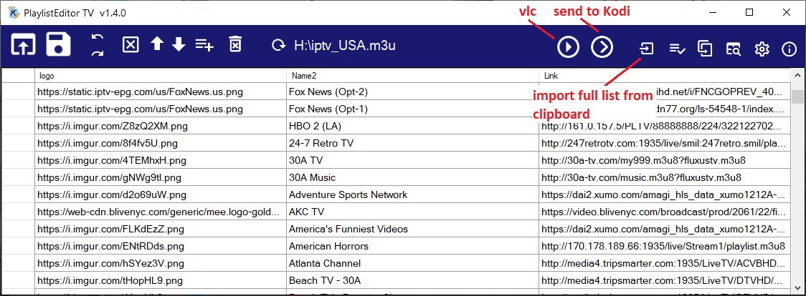
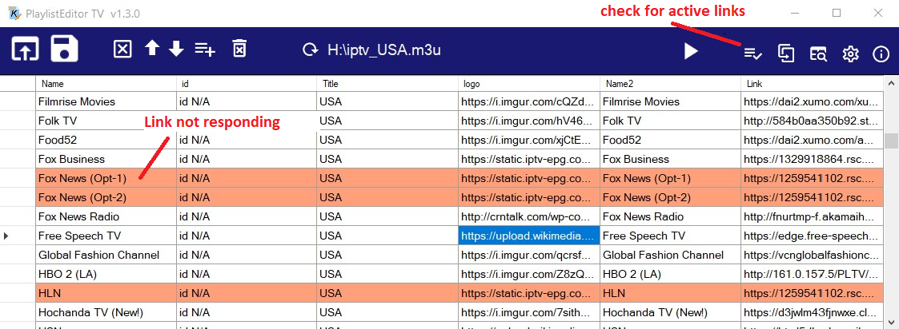
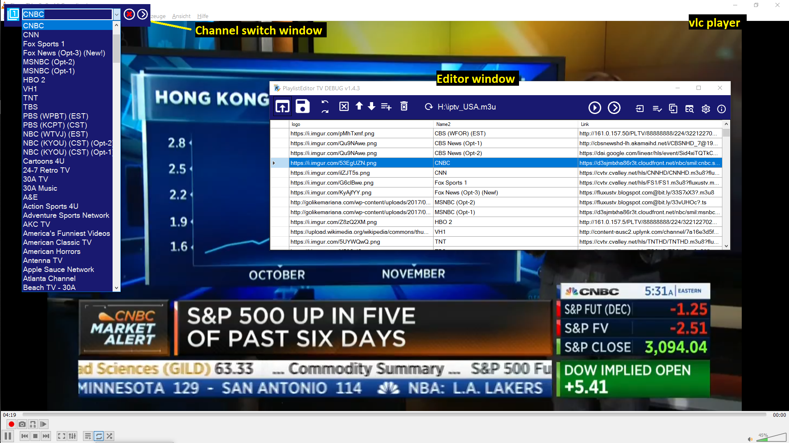

# Playlist Editor TV
Editor for IPTV m3u files (with vlc media player and kodi support)

1.5.4 Multi-threading for link check, up to 20 parallel tasks, can be selected in settings. Big performance increase. 

1.5.3 Result of link check is stored a re-scan is often not necessary (force re-scan with Alt-click).

1.5.2 bugfix for *Fill cells from Clipboard* function, rtmp (links cannot be tested) and links with Error 403 are now marked with gray and can be selected separately. *Fill cells from Clipboard* can be activated with Ctrl-v. 

 
  Special thanks to dobbelina for helpful ideas and testing, improved the usablility a lot. 





- Move line to top of list for faster sorting of favorites. Double buffer for better UI performance.
- Send link to Kodi device e.g. Raspberry PI
- You can edit and create Kodi IPTV playlists, add, rename, move and delete playlist entries, drag&drop m3u files to add to list. 
- Search for names and find duplicate links to merge files. 
- Copy/paste links to other editor window. 
- Play links on Windows with installed VLC player 




## Getting Started

You can download the compiled EXE file [released](https://github.com/Isayso/PlaylistEditorTV/releases) for Windows 10.  


### Prerequisites

- Windows with .NET Framework 4.6.2
- Installation of VLC player for play function 


### Installing

Unzip and run the exe file. No install necessary.


```
PlaylistEditorTV.exe
```


You can connect the .m3u filename extension with the program or open files with drag and drop on the icon.


## Built With

* [Visual Studio 2017](https://visualstudio.microsoft.com/) - C# with .NET 4.6.2


## License

This project is licensed under the MIT License - see the [LICENSE](LICENSE) file for details

## Acknowledgments

* Inspired from various IPTV editors for Kodi

## Keyboard shortcuts
- Ctrl + C copy rows/cells
- Ctrl + V paste rows/cells
- Ctrl + F find string
- Ctrl + I paste insert row
- Ctrl + X cut row
- Ctrl + N open new window
- Ctrl + S save
- Ctrl + P send link to Kodi
- Ctrl + T move line to top of list
- Ctrl + B move line to bottom of list
- Ctrl + +/- change font size
- Ctrl + 1/2 move line up/down
- del    delete selected row

  


