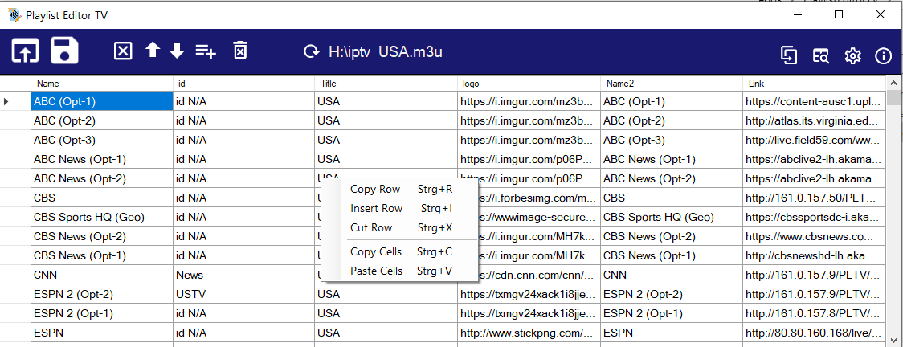

# Playlist Editor TV
Editor for TV m3u files (play with vlc media player in dev tree)

Copy, cut&paste functions, sort, search and find duplicates.




## Getting Started

You can download the compiled EXE file [released](https://github.com/Isayso/PlaylistEditorTV/releases) for Windows 10.  


### Prerequisites

Windows with .NET Framework 4.6.2


### Installing

Unzip and run the exe file. No install necessary.


```
PlaylistEditorIPTV.exe
```


You can connect the .m3u filename extension with the program or open files with drag and drop on the icon.

## Built With

* [Visual Studio 2017](https://visualstudio.microsoft.com/) - C# with .NET 4.6.2


## License

This project is licensed under the MIT License - see the [LICENSE](LICENSE) file for details

## Acknowledgments

* Inspired from various IPTV editors for Kodi
