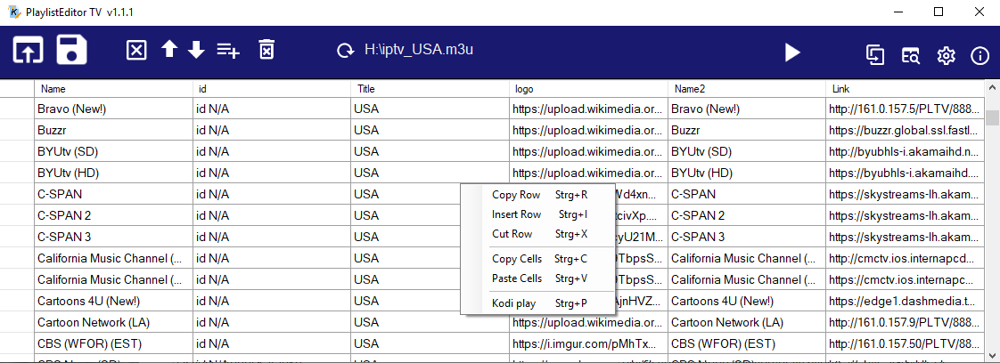

# Playlist Editor TV
Editor for TV m3u files (with vlc media player support)

- NEW in 1.1: Send link to Kodi device e.g. Raspberry PI
- You can edit and create Kodi IPTV playlists, add, rename, move and delete playlist entries, drag&drop m3u files to add to list. 
- Search for names and find duplicate links to merge files. 
- Copy/paste links to other editor window. 
- Play links on Windows with installed VLC player 




## Getting Started

You can download the compiled EXE file [released](https://github.com/Isayso/PlaylistEditorTV/releases) for Windows 10.  


### Prerequisites

- Windows with .NET Framework 4.6.2
- Installation of VLC player for play function 


### Installing

Unzip and run the exe file. No install necessary.


```
PlaylistEditorTV.exe
```


You can connect the .m3u filename extension with the program or open files with drag and drop on the icon.

## Built With

* [Visual Studio 2017](https://visualstudio.microsoft.com/) - C# with .NET 4.6.2


## License

This project is licensed under the MIT License - see the [LICENSE](LICENSE) file for details

## Acknowledgments

* Inspired from various IPTV editors for Kodi
